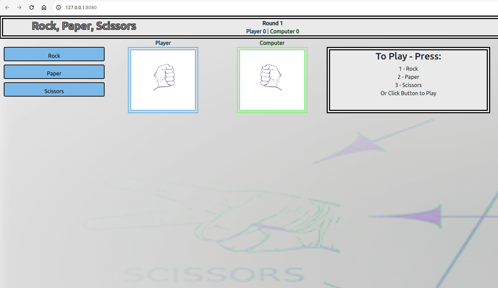
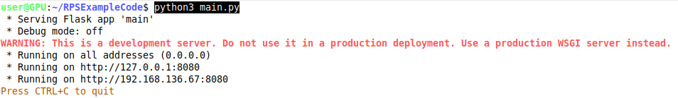

## Rock Paper Scissors example game  

***
### Run with: "python3 main.py"
+ Be sure to add Flask package first using: "pip3 install Flask"
+ In your browser, open the IP provided
  (latest Chrome browser is recommended)

